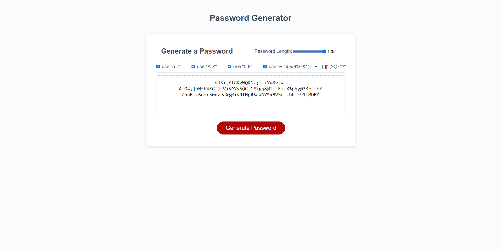

# password_gen8r

  
## Table of Contents
- [Table of Contents](#table-of-contents)
- [Description](#description)
- [User Story](#user-story)
- [Acceptance Criteria](#acceptance-criteria)
- [Usage](#usage)
- [Questions](#questions)

## Description
  
A Javascript application that uses and html page to obtain user input for length and type of characters in order to generate a random password.
The password can be between 8-128 characters, and can contain:

- lowercase letters
- uppercase letters
- numbers
- symbols

The user is prompted for length and character type in the html input feilds BEFORE clicking the Generate Password button.

AFTER clicking the generate password button:
The password is then printed into the html textarea, visible to the user.


  

## User Story
  
```
AS AN employee with access to sensitive data
I WANT to randomly generate a password that meets certain criteria
SO THAT I can create a strong password that provides greater security
```
  
## Acceptance Criteria
  
``` 
GIVEN I need a new, secure password
WHEN I click the button to generate a password
THEN I am presented with a series of prompts for password criteria
WHEN prompted for password criteria
THEN I select which criteria to include in the password
WHEN prompted for the length of the password
THEN I choose a length of at least 8 characters and no more than 128 characters
WHEN asked for character types to include in the password
THEN I confirm whether or not to include lowercase, uppercase, numeric, and/or special characters
WHEN I answer each prompt
THEN my input should be validated and at least one character type should be selected
WHEN all prompts are answered
THEN a password is generated that matches the selected criteria
WHEN the password is generated
THEN the password is either displayed in an alert or written to the page
```


  
## Usage 
Load the webpage, select the characters you would like to use, and click Generate Password.

## Questions
[Nathan Patnaude](mailto:Nathanpatnaude@gmail.com) , [GitHub Account](https://github.com/Nathanpatnaude)<br />
This Project is on [GitHub](https://github.com/Nathanpatnaude/password_gen8r)


